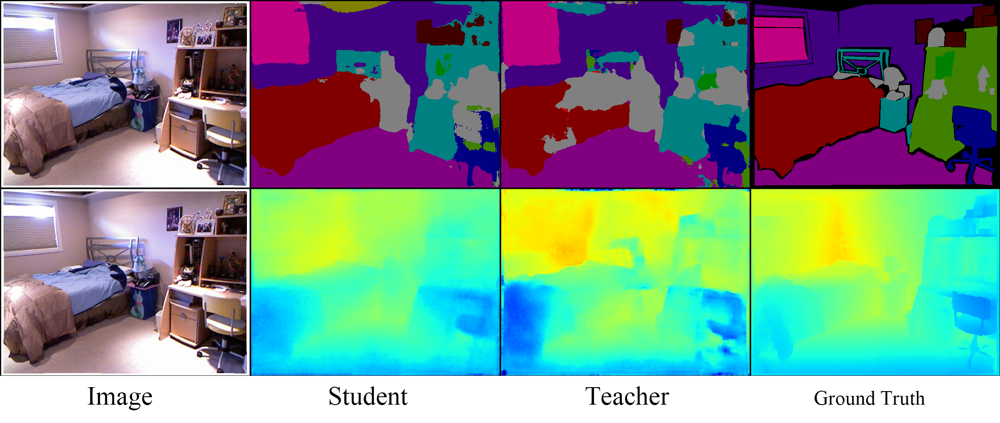
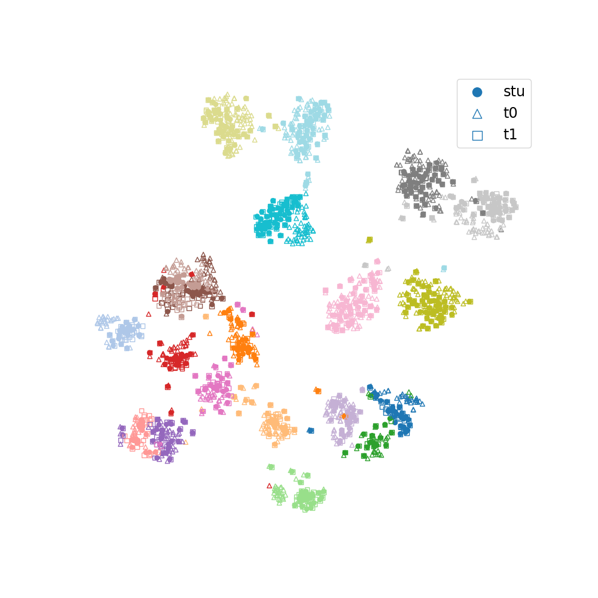
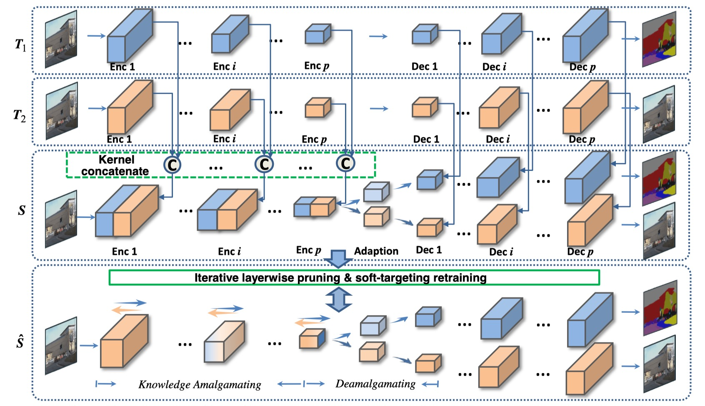
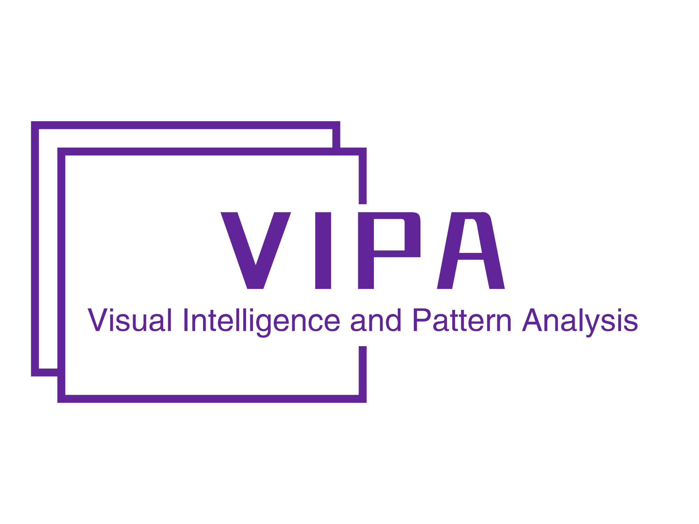

  
  

# KAmalEngine

KAmalEngine is a software system that implements Knowledge Amalgamation algorithms. In knowledge amalgamation, we use trained deep network models available online to do a model-reusing task. Given multiple pretrained teacher networks, which specializes in different vision problems, the goal of knowledge amalgamation is to learn a lightweight student model capable of handling the comprehensive tasks, without human-labeled annotations. It is written in Python and powered by the Pytorch deep learning framework.

## Table of contents
   * [Introduction](#Introduction)
   * [Algorithms](#Algorithms)
   * [Help](#help)

## Introduction

The goal of KamalEngine is to provide a high-quality, high-performance code framework for Knowledge Amalgamation *research*. For more extensive discussions about Knowledge Amalgamation, please see the [AAAI 2019 paper](https://arxiv.org/abs/1811.02796v1). This respository focuses on designed a flexible code framework in order to support rapid implementation and evaluation of novel research. KamalEngine includes implementations of the following Knowledge Amalgamation algorithms:
- [Amalgamating Knowledge towards Comprehensive Classification](https://arxiv.org/abs/1811.02796v1) -- *AAAI 2019*
- [Student Becoming the Master: Knowledge Amalgamation for Joint Scene Parsing, Depth Estimation, and More](https://arxiv.org/abs/1904.10167) -- *CVPR 2019*
- [Knowledge Amalgamation from Heterogeneous Networks by Common Feature Learning](http://arxiv.org/abs/1906.10546) -- *IJCAI 2019*
- [Learning Semantic Image Compression from Distinct-task Teachers]()

## Algorithms
This repo provides some algorithms of KA.

### Student Becoming the Master
Knowledge amalgamation for multiple teachers by feature projection.  
[Student Becoming the Master: Knowledge Amalgamation for Joint Scene Parsing, Depth Estimation, and More](https://arxiv.org/abs/1904.10167) -- *CVPR 2019*  

### Common Feature Learning
Extract common features from multiple teacher models.  
[Knowledge Amalgamation from Heterogeneous Networks by Common Feature Learning](http://arxiv.org/abs/1906.10546) -- *IJCAI 2019*

Feature Space             |  Common Space
:-------------------------:|:-------------------------:
  |  

### Amalgamating Knowledge towards Comprehensive Classification
Layer-wise amalgamation  
[Amalgamating Knowledge towards Comprehensive Classification](https://arxiv.org/abs/1811.02796v1) -- *AAAI 2019*  

### Recombination
Build a new multi-task model by combining&pruning weight matrixs from distinct-task teachers.

## Help
For more information, see `docs` and `examples`

## Authors

GongFan Fang - [VainF](https://github.com/VainF)  
YiXin Ji - [Ssssseason](https://github.com/Ssssseason)  
YanLing Yin - [ylyinzju](https://github.com/ylyinzju)  

[Homepage of VIPA Group](https://www.vipazoo.cn/), Zhejiang University, China

  
  

