<div  align="center">  

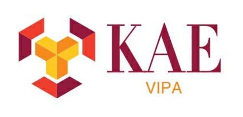

</div>

## Introduction

**KAmalEngine (KAE) aims at building a lightweight algorithm package for Knowledge Amalgamation, Knowledge Distillation and Model Transferability Estimation.** 

**Features:**

  * Algorithms for knowledge amalgamation and distillation 
  * Deep model transferability estimation based on attribution maps
  * Predefined callbacks & metrics for evaluation and visualization
  * Easy-to-use tools for multi-tasking training, e.g. synchronized transformation

<div  align="center">  
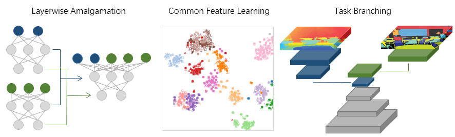 


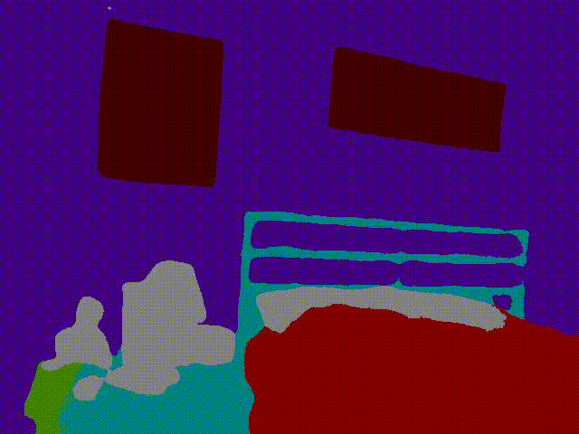

</div>

## Table of contents
- [Introduction](#introduction)
- [Table of contents](#table-of-contents)
- [Quick Start](#quick-start)
- [Algorithms](#algorithms)
  - [1. Knowledge Amalgamation](#1-knowledge-amalgamation)
  - [2. Knowledge Distillation](#2-knowledge-distillation)
  - [3. Model Transferability](#3-model-transferability)
- [Transferability Graph](#transferability-graph)
- [Authors](#authors)

## Quick Start

Please follow the instructions in [QuickStart.md](docs/QuickStart.md) for the basic usage of KAE. More examples can be found in [examples](examples/), including [knowledge amalgamation](examples/amalgamation/), [knowledge distillation](examples/distillation/), [transferability](examples/transferability/) and [model slimming](examples/slim/).

## Algorithms

### 1. Knowledge Amalgamation

<details>
<summary>Amalgamating Knowledge towards Comprehensive Classification</summary>

[Amalgamating Knowledge towards Comprehensive Classification](https://arxiv.org/abs/1811.02796v1) (*AAAI 2019*)  

 

```
@inproceedings{shen2019amalgamating,
  author={Shen, Chengchao and Wang, Xinchao and Song, Jie and Sun, Li and Song, Mingli},
  title={Amalgamating Knowledge towards Comprehensive Classification},
  booktitle={AAAI Conference on Artificial Intelligence (AAAI)},
  pages={3068--3075},
  year={2019}
}
```

**Scripts can be found in [examples/amalgamation/layerwise_ka](examples/amalgamation/layerwise_ka)**

</details>

<details>
<summary>Customizing Student Networks From Heterogeneous Teachers via Adaptive Knowledge Amalgamation</summary>

[Customizing Student Networks From Heterogeneous Teachers via Adaptive Knowledge Amalgamation](https://arxiv.org/abs/1908.07121) (*ICCV 2019*)  
<div  align="center">
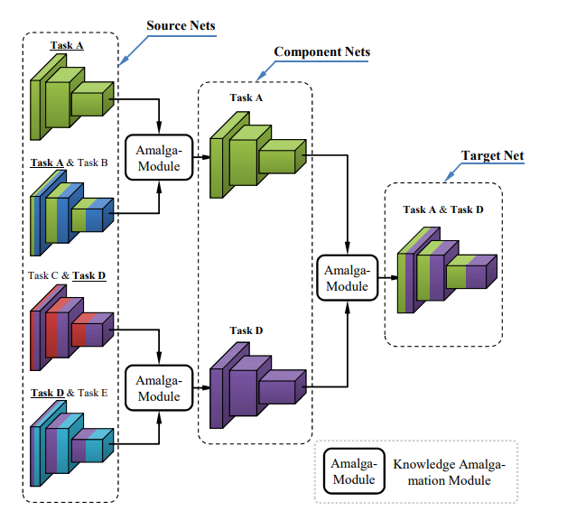 
</div>

```
@inproceedings{shen2019customizing,
  title={Customizing student networks from heterogeneous teachers via adaptive knowledge amalgamation},
  author={Shen, Chengchao and Xue, Mengqi and Wang, Xinchao and Song, Jie and Sun, Li and Song, Mingli},
  booktitle={Proceedings of the IEEE/CVF International Conference on Computer Vision},
  pages={3504--3513},
  year={2019}
}
```
</details>

<details>
<summary>Student Becoming the Master: Knowledge Amalgamation for Joint Scene Parsing, Depth Estimation, and More</summary>

[Student Becoming the Master: Knowledge Amalgamation for Joint Scene Parsing, Depth Estimation, and More](https://arxiv.org/abs/1904.10167) (*CVPR 2019*)  

 

```
@inproceedings{ye2019student,
  title={Student Becoming the Master: Knowledge Amalgamation for Joint Scene Parsing, Depth Estimation, and More},
  author={Ye, Jingwen and Ji, Yixin and Wang, Xinchao and Ou, Kairi and Tao, Dapeng and Song, Mingli},
  booktitle={Proceedings of the IEEE Conference on Computer Vision and Pattern Recognition},
  pages={2829--2838},
  year={2019}
}
```
</details>

<details>
<summary>Knowledge Amalgamation from Heterogeneous Networks by Common Feature Learning</summary>

[Knowledge Amalgamation from Heterogeneous Networks by Common Feature Learning](http://arxiv.org/abs/1906.10546) (*IJCAI 2019*)

|                             Feature Space                             |                             Common Space                             |
| :-------------------------------------------------------------------: | :------------------------------------------------------------------: |
| 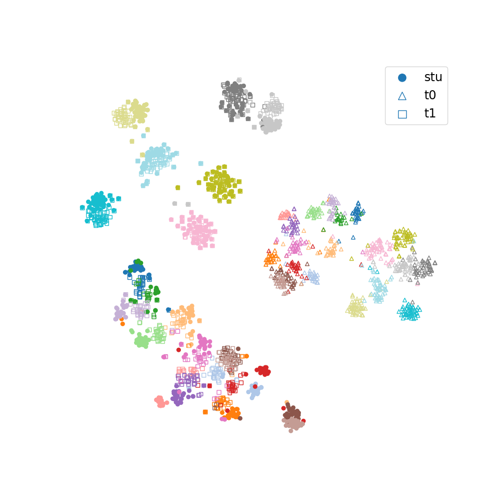 |  |

```
@inproceedings{luo2019knowledge,
  title={Knowledge Amalgamation from Heterogeneous Networks by Common Feature Learning},
  author={Luo, Sihui and Wang, Xinchao and Fang, Gongfan and Hu, Yao and Tao, Dapeng and Song, Mingli},
  booktitle={Proceedings of the 28th International Joint Conference on Artificial Intelligence (IJCAI)},
  year={2019},
}
```
</details>

<details>
<summary>Collaboration by competition: Self-coordinated knowledge amalgamation for multi-talent student learning</summary>

[Collaboration by competition: Self-coordinated knowledge amalgamation for multi-talent student learning](https://www.ecva.net/papers/eccv_2020/papers_ECCV/papers/123510630.pdf) (*ECCV 2020*)

<div  align="center">
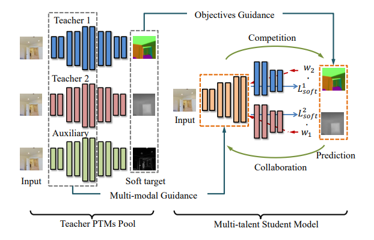 
</div>

```
@inproceedings{luo2020collaboration,
  title={Collaboration by competition: Self-coordinated knowledge amalgamation for multi-talent student learning},
  author={Luo, Sihui and Pan, Wenwen and Wang, Xinchao and Wang, Dazhou and Tang, Haihong and Song, Mingli},
  booktitle={Computer Vision--ECCV 2020: 16th European Conference, Glasgow, UK, August 23--28, 2020, Proceedings, Part VI 16},
  pages={631--646},
  year={2020},
  organization={Springer}
}
```
</details>

<details>
<summary>Knowledge Amalgamation for Object Detection With Transformers</summary>

[Knowledge Amalgamation for Object Detection With Transformers](https://arxiv.org/abs/2203.03187) (*TIP 2021*)

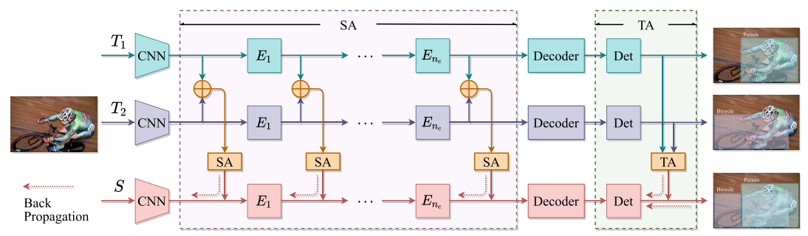 

```
@article{zhang2023knowledge,
  title={Knowledge Amalgamation for Object Detection With Transformers},
  author={Zhang, Haofei and Mao, Feng and Xue, Mengqi and Fang, Gongfan and Feng, Zunlei and Song, Jie and Song, Mingli},
  journal={IEEE Transactions on Image Processing},
  volume={32},
  pages={2093--2106},
  year={2023},
  publisher={IEEE}
}
```

**Scripts can be found in [examples/amalgamation/transformer_ka](examples/amalgamation/transformer_ka)**

</details>

<details>
<summary>FedKA: Federated Selective Aggregation for Knowledge Amalgamation</summary>

[Federated Selective Aggregation for Knowledge Amalgamation](https://arxiv.org/abs/2207.13309) (*CHIP 2022*)

<div align="center">
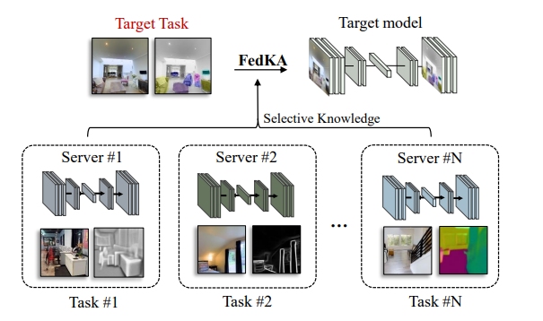 
</div>

```
@article{xie2022federated,
  title={Federated Selective Aggregation for Knowledge Amalgamation},
  author={Xie, Donglin and Yu, Ruonan and Fang, Gongfan and Song, Jie and Feng, Zunlei and Wang, Xinchao and Sun, Li and Song, Mingli},
  journal={arXiv preprint arXiv:2207.13309},
  year={2022}
}
```
</details>


### 2. Knowledge Distillation

<details>
<summary>Hearing Lips: Improving Lip Reading by Distilling Speech Recognizers</summary>

[Hearing Lips: Improving Lip Reading by Distilling Speech Recognizers](https://arxiv.org/abs/1911.11502) (*AAAI 2020*)

<div align='center'>
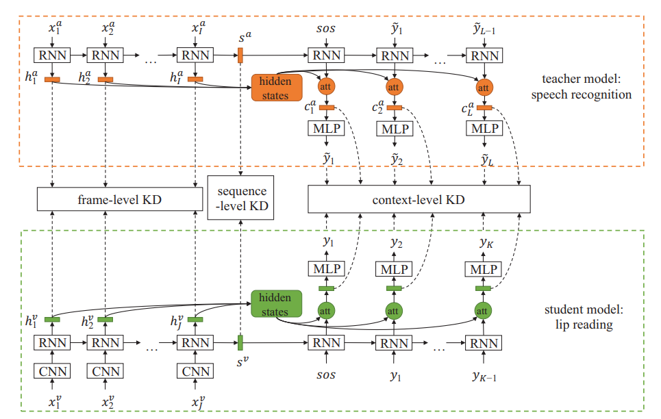 
</div>

```
@inproceedings{zhao2020hearing,
  title={Hearing lips: Improving lip reading by distilling speech recognizers},
  author={Zhao, Ya and Xu, Rui and Wang, Xinchao and Hou, Peng and Tang, Haihong and Song, Mingli},
  booktitle={Proceedings of the AAAI Conference on Artificial Intelligence},
  volume={34},
  number={04},
  pages={6917--6924},
  year={2020}
}
```
</details>

<details>
<summary>Progressive Network Grafting for Few-Shot Knowledge Distillation</summary>

[Progressive Network Grafting for Few-Shot Knowledge Distillation](https://arxiv.org/abs/2012.04915) (*AAAI 2021*)

<div align='center'>
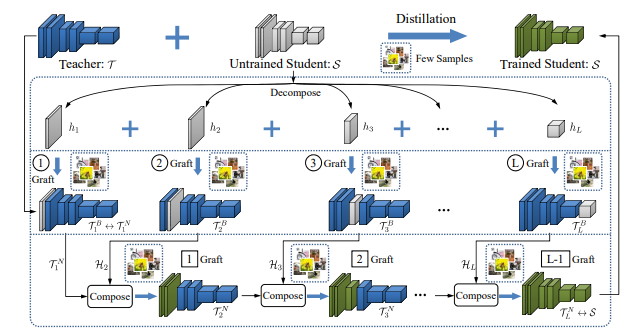 
</div>

```
@inproceedings{shen2021progressive,
  title={Progressive network grafting for few-shot knowledge distillation},
  author={Shen, Chengchao and Wang, Xinchao and Yin, Youtan and Song, Jie and Luo, Sihui and Song, Mingli},
  booktitle={Proceedings of the AAAI Conference on Artificial Intelligence},
  volume={35},
  number={3},
  pages={2541--2549},
  year={2021}
}
```
</details>

<details>
<summary>KDExplainer: A Task-oriented Attention Model for Explaining Knowledge Distillation</summary>

[KDExplainer: A Task-oriented Attention Model for Explaining Knowledge Distillation](https://arxiv.org/abs/2105.04181) (*IJCAI 2021*)

<div align='center'>
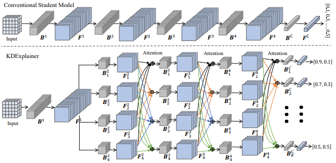 
</div>

```
@article{xue2021kdexplainer,
  title={Kdexplainer: A task-oriented attention model for explaining knowledge distillation},
  author={Xue, Mengqi and Song, Jie and Wang, Xinchao and Chen, Ying and Wang, Xingen and Song, Mingli},
  journal={arXiv preprint arXiv:2105.04181},
  year={2021}
}
```
</details>

<details>
<summary>CMI: Contrastive Model Inversion for Data-Free Knowledge Distillation</summary>

[Contrastive Model Inversion for Data-Free Knowledge Distillation](https://arxiv.org/abs/2105.08584) (*IJCAI 2021*)

<div align='center'>
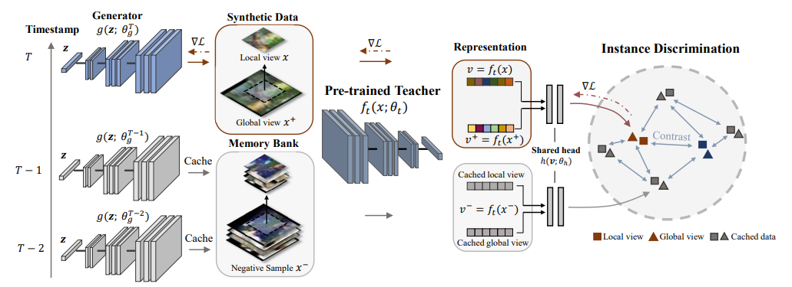 
</div>

```
@article{fang2021contrastive,
  title={Contrastive model inversion for data-free knowledge distillation},
  author={Fang, Gongfan and Song, Jie and Wang, Xinchao and Shen, Chengchao and Wang, Xingen and Song, Mingli},
  journal={arXiv preprint arXiv:2105.08584},
  year={2021}
}
```
</details>

<details>
<summary>MosaicKD: Mosaicking to Distill: Knowledge Distillation from Out-of-Domain Data</summary>

[Mosaicking to Distill: Knowledge Distillation from Out-of-Domain Data](https://arxiv.org/abs/2110.15094) (*NeurIPS 2021*)

<div align='center'>
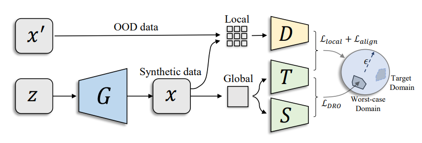 
</div>

```
@article{fang2021mosaicking,
  title={Mosaicking to distill: Knowledge distillation from out-of-domain data},
  author={Fang, Gongfan and Bao, Yifan and Song, Jie and Wang, Xinchao and Xie, Donglin and Shen, Chengchao and Song, Mingli},
  journal={Advances in Neural Information Processing Systems},
  volume={34},
  pages={11920--11932},
  year={2021}
}
```
</details>

<details>
<summary>FastDFKD: Up to 100× Faster Data-free Knowledge Distillation</summary>

[Up to 100× Faster Data-free Knowledge Distillation](https://arxiv.org/abs/2112.06253) (*AAAI 2022*)

<div align='center'>
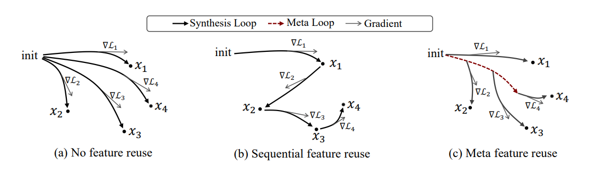 
</div>

```
@inproceedings{fang2022up,
  title={Up to 100x faster data-free knowledge distillation},
  author={Fang, Gongfan and Mo, Kanya and Wang, Xinchao and Song, Jie and Bei, Shitao and Zhang, Haofei and Song, Mingli},
  booktitle={Proceedings of the AAAI Conference on Artificial Intelligence},
  volume={36},
  number={6},
  pages={6597--6604},
  year={2022}
}
```
</details>

<details>
<summary>Data-Free Adversarial Distillation</summary>

[Data-Free Adversarial Distillation](https://arxiv.org/abs/1912.11006)

<div align='center'>
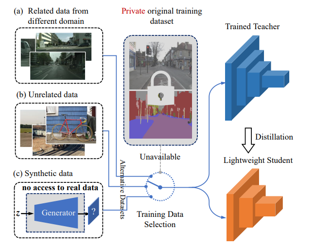 
</div>

```
@article{fang2019data,
  title={Data-free adversarial distillation},
  author={Fang, Gongfan and Song, Jie and Shen, Chengchao and Wang, Xinchao and Chen, Da and Song, Mingli},
  journal={arXiv preprint arXiv:1912.11006},
  year={2019}
}
```

**Scripts can be found in [examples/distillation/dfkd](examples/distillation/dfkd)**

</details>

<details>
<summary>Safe Distillation Box</summary>

[Safe Distillation Box](https://arxiv.org/abs/2112.03695) (*AAAI 2022*)

<div align='center'>
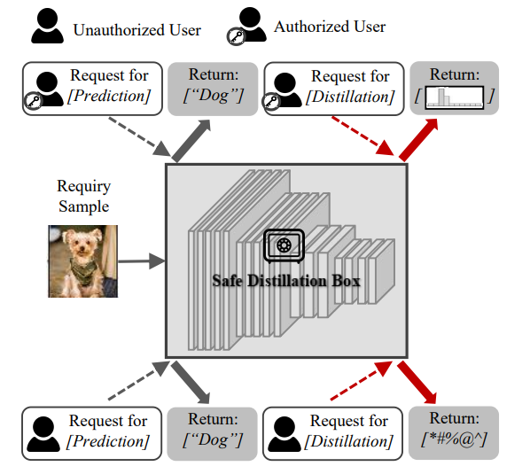 
</div>

```
@inproceedings{ye2022safe,
  title={Safe distillation box},
  author={Ye, Jingwen and Mao, Yining and Song, Jie and Wang, Xinchao and Jin, Cheng and Song, Mingli},
  booktitle={Proceedings of the AAAI Conference on Artificial Intelligence},
  volume={36},
  number={3},
  pages={3117--3124},
  year={2022}
}
```
</details>

<details>
<summary>Spot-adaptive Knowledge Distillation</summary>

[Spot-adaptive Knowledge Distillation](https://arxiv.org/abs/2205.02399) (*TIP 2022*)

<div align='center'>
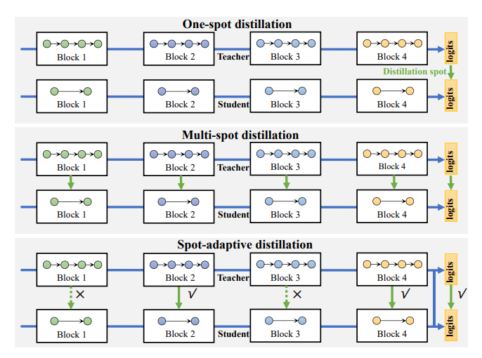 
</div>

```
@article{song2022spot,
  title={Spot-adaptive knowledge distillation},
  author={Song, Jie and Chen, Ying and Ye, Jingwen and Song, Mingli},
  journal={IEEE Transactions on Image Processing},
  volume={31},
  pages={3359--3370},
  year={2022},
  publisher={IEEE}
}
```

**Scripts can be found in [examples/distillation/sakd](examples/distillation/sakd)**

</details>

<details>
<summary>Tree-like Decision Distillation</summary>

[Tree-like Decision Distillation](https://ieeexplore.ieee.org/document/9577817) (*CVPR 2021*)

<div align='center'>
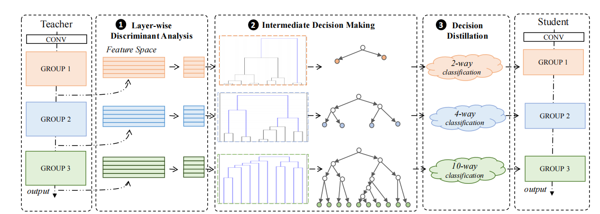 
</div>

```
@inproceedings{song2021tree,
  title={Tree-like decision distillation},
  author={Song, Jie and Zhang, Haofei and Wang, Xinchao and Xue, Mengqi and Chen, Ying and Sun, Li and Tao, Dacheng and Song, Mingli},
  booktitle={Proceedings of the IEEE/CVF Conference on Computer Vision and Pattern Recognition},
  pages={13488--13497},
  year={2021}
}
```

**Script can be found in [examples/distillation/tdd](./examples/distillation/tdd)**
</details>

<details>
<summary>Context Correlation Distillation for Lip Reading</summary>

[Context Correlation Distillation for Lip Reading](https://www.jcad.cn/cn/article/doi/10.3724/SP.J.1089.2022.19723) (*China MM 2022*)

<div align='center'>
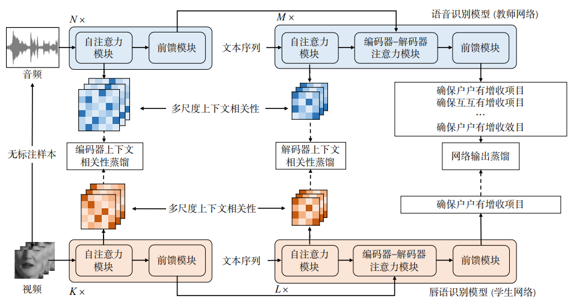 
</div>

```
@articleInfo{19723,
title = "针对唇语识别的上下文相关性蒸馏方法",
journal = "计算机辅助设计与图形学学报",
volume = "34",
number = "19723,
pages = "1559",
year = "2022",
note = "",
issn = "1003-9775",
doi = "10.3724/SP.J.1089.2022.19723",
url = "https://www.jcad.cn/article/doi/10.3724/SP.J.1089.2022.19723",
author = "赵雅","冯尊磊","王慧琼","宋明黎",keywords = "唇语识别","知识蒸馏","跨模态",
}
```
</details>


### 3. Model Transferability 

<details>
<summary>Deep model transferability from attribution maps</summary>

[Deep model transferability from attribution maps](https://arxiv.org/abs/1909.11902) (*NeurIPS 2019*)

<div align='center'>
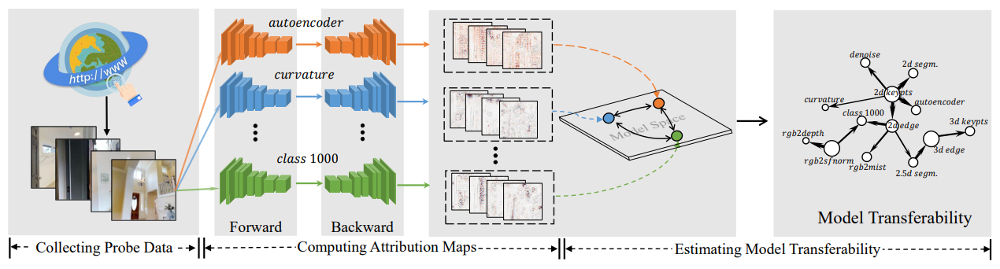 
</div>

```
@inproceedings{song2019deep,
  title={Deep model transferability from attribution maps},
  author={Song, Jie and Chen, Yixin and Wang, Xinchao and Shen, Chengchao and Song, Mingli},
  booktitle={Advances in Neural Information Processing Systems},
  pages={6182--6192},
  year={2019}
}
```
</details>

<details>
<summary>DEPARA: Deep model transferability from attribution maps</summary>

[Deep model transferability from attribution maps](https://arxiv.org/abs/1909.11902) (*CVPR 2020*)

<div align='center'>
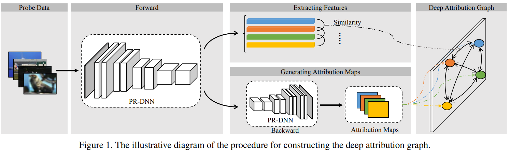 
</div>

```
@inproceedings{song2020depara,
  title={DEPARA: Deep Attribution Graph for Deep Knowledge Transferability},
  author={Song, Jie and Chen, Yixin and Ye, Jingwen and Wang, Xinchao and Shen, Chengchao and Mao, Feng and Song, Mingli},
  booktitle={Proceedings of the IEEE/CVF Conference on Computer Vision and Pattern Recognition},
  pages={3922--3930},
  year={2020}
}
```
</details>


<!-- ### 4. Recombination

<details>
<summary>Recombination</summary>

Build a new multi-task model by combining & pruning weight matrixs from distinct-task teachers.

<div align='center'>
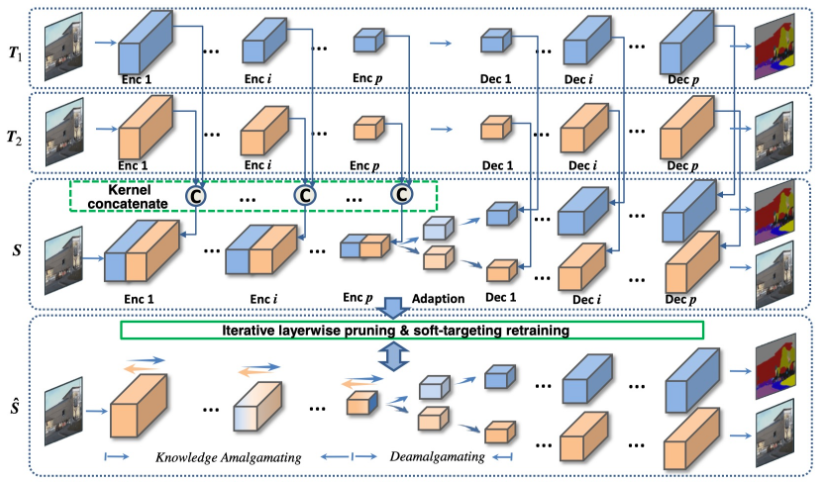 
</div>

</details> -->


## Transferability Graph

This is an example for deep model transferability on 300 classification models. see [examples/transferability](examples/transferability) for more details.

<div align='center'>
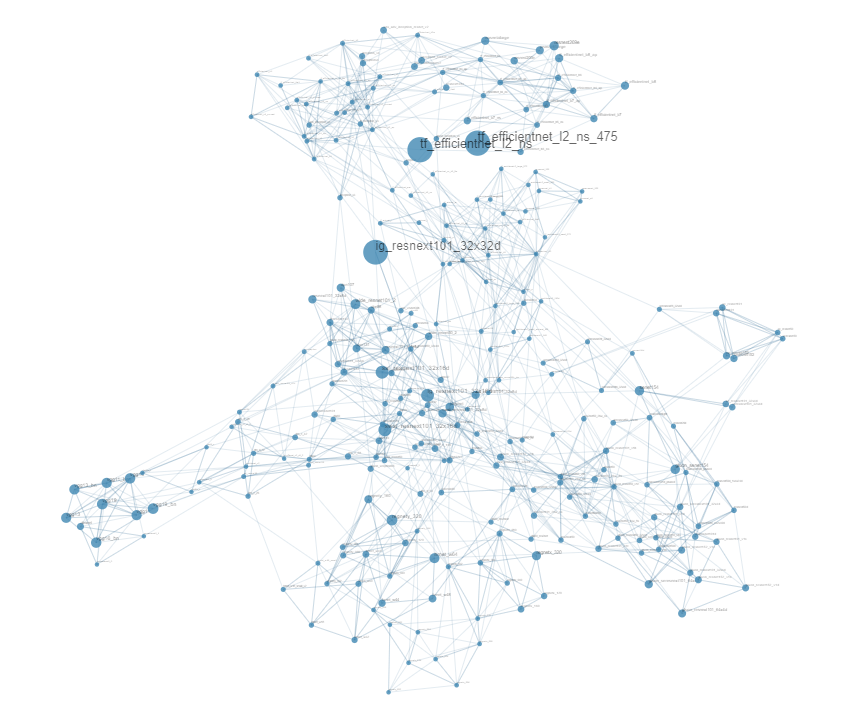 
</div>

## Authors

This project is developed by [VIPA Lab](http://vipazoo.cn) from Zhejiang University and [Zhejiang Lab](http://www.zhejianglab.com/)

<div align='center'>
  
</div>
