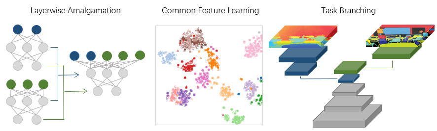
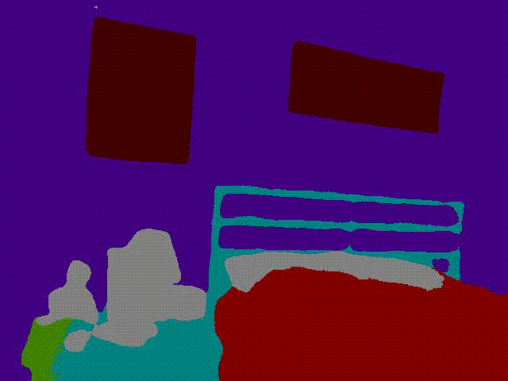
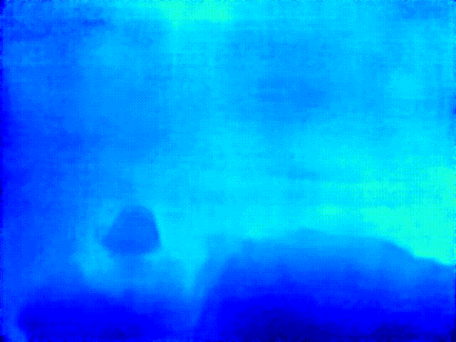

<div  align="center">  

  

</div>

## Introduction

KAmalEngine (KAE) aims at building a lightweight algorithm package for Knowledge Amalgamation and Model Transferability Estimation. 

Features:

  * Basic algorithms for knowledge amalgamation and distillation 
  * Deep model transferability estimation based on attribution maps
  * Easy-to-use interface for multi-tasking amalgamation
  * Predefined callbacks & metrics for evaluation and visualization

<div  align="center">  
 




</div>

## Algorithms

### Knolwedge Amalgamation

#### 1. Task Branching
[Student Becoming the Master: Knowledge Amalgamation for Joint Scene Parsing, Depth Estimation, and More](https://arxiv.org/abs/1904.10167) (*CVPR 2019*)  

 

#### 2. Common Feature Learning
[Knowledge Amalgamation from Heterogeneous Networks by Common Feature Learning](http://arxiv.org/abs/1906.10546) (*IJCAI 2019*)

Feature Space             |  Common Space
:-------------------------:|:-------------------------:
  |  

#### 3. Layerwise Amalgamation
[Amalgamating Knowledge towards Comprehensive Classification](https://arxiv.org/abs/1811.02796v1) (*AAAI 2019*)  

 

#### 4. Recombination
Build a new multi-task model by combining & pruning weight matrixs from distinct-task teachers.

 


### Deep Model trasnferability

#### 1. Deep model transferability from attribution maps

 

#### 2. DEPARA: Deep Attribution Graph for Deep Knowledge Transferability

 


## Transferability Graph

 

## Team

<div>
  
</div>

<div>
  
</div>

## Citation
```
@inproceedings{shen2019amalgamating,
  author={Shen, Chengchao and Wang, Xinchao and Song, Jie and Sun, Li and Song, Mingli},
  title={Amalgamating Knowledge towards Comprehensive Classification},
  booktitle={AAAI Conference on Artificial Intelligence (AAAI)},
  pages={3068--3075},
  year={2019}
}
```

```
@inproceedings{ye2019student,
  title={Student Becoming the Master: Knowledge Amalgamation for Joint Scene Parsing, Depth Estimation, and More},
  author={Ye, Jingwen and Ji, Yixin and Wang, Xinchao and Ou, Kairi and Tao, Dapeng and Song, Mingli},
  booktitle={Proceedings of the IEEE Conference on Computer Vision and Pattern Recognition},
  pages={2829--2838},
  year={2019}
}
```

```
@inproceedings{luo2019knowledge,
  title={Knowledge Amalgamation from Heterogeneous Networks by Common Feature Learning},
  author={Luo, Sihui and Wang, Xinchao and Fang, Gongfan and Hu, Yao and Tao, Dapeng and Song, Mingli},
  booktitle={Proceedings of the 28th International Joint Conference on Artificial Intelligence (IJCAI)},
  year={2019},
}
```

```
@inproceedings{shen2019customizing,
  author={Shen, Chengchao and Xue, Mengqi and Wang, Xinchao and Song, Jie and Sun, Li and Song, Mingli},
  title={Customizing student networks from heterogeneous teachers via adaptive knowledge amalgamation},
  booktitle={The IEEE International Conference on Computer Vision (ICCV)},
  year={2019}
}
```

```
@inproceedings{Ye_Amalgamating_2019,
  year={2019},
  author={Ye, Jingwen and Wang, Xinchao and Ji, Yixin and Ou, Kairi and Song, Mingli},
  title={Amalgamating Filtered Knowledge: Learning Task-customized Student from Multi-task Teachers}
  booktitle={Proceedings of the 28th International Joint Conference on Artificial Intelligence (IJCAI)},
  year={2019},
}
```

```
@inproceedings{song2020depara,
  title={DEPARA: Deep Attribution Graph for Deep Knowledge Transferability},
  author={Song, Jie and Chen, Yixin and Ye, Jingwen and Wang, Xinchao and Shen, Chengchao and Mao, Feng and Song, Mingli},
  booktitle={Proceedings of the IEEE/CVF Conference on Computer Vision and Pattern Recognition},
  pages={3922--3930},
  year={2020}
}
```

```
@inproceedings{song2019deep,
  title={Deep model transferability from attribution maps},
  author={Song, Jie and Chen, Yixin and Wang, Xinchao and Shen, Chengchao and Song, Mingli},
  booktitle={Advances in Neural Information Processing Systems},
  pages={6182--6192},
  year={2019}
}
```


