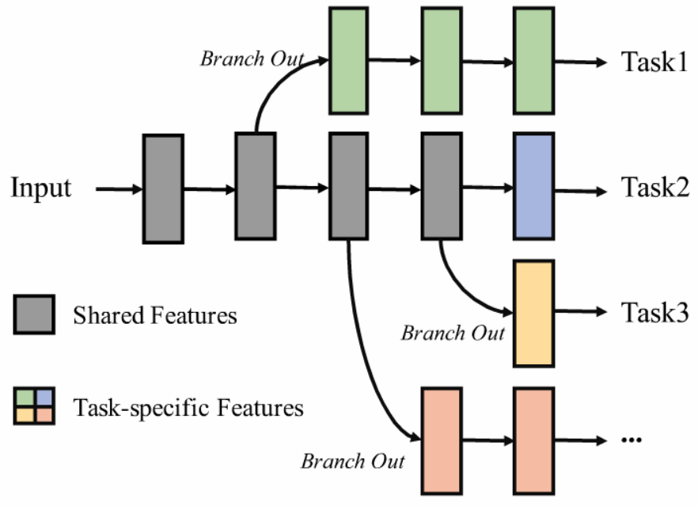

# Amalgamating Filtered Knowledge: Learning Task-customized Student from Multi-task Teachers
Here provided a new PyTorch implementation of the paper: [Amalgamating Filtered Knowledge: Learning Task-customized Student from Multi-task Teachers](https://arxiv.org/abs/1905.11569). The original code is in TensorFlow. 

> **Note**: Owing to time constraints, the performance of this implementation is not as satisfying as that of previous experiments. Though it offers a convenient way for the method proposed in the paper.

Example codes are all in the folder `examples/afk`.

## Pre-Trained Teacher Networks

The net structure of teachers (semantic parsing, depth prediction, surface normal prediction) is either ResNet or DenseNet.

Use `train_teacher.py` to train teachers.

- `--classes`: A list of string. The name of classes to be classified.
- `--vis_env`: The name of the visdom environment.

To change the basic net structure, just comment corresponding code.

## Amalgamation

  
  

Use `train.py` to combine teachers.
- `--init_ckpt`: A list of string. The first two checkpoints are pre-trained teacher models, and the last one is to recover target joint student model.
- `--phase`: Must be 'block' or 'finetune'. To choose from training block by block or finetune.
- `--indices`: A list of integer. To choose where to branch out for each task, starting from zero. When the basic net structure is ResNet50, the unit is layer. And when it comes to DenseNet40, the unit is block.
- `--split_size`: A list of integer. The number of classes to be classified by each teacher. 
- `--arange_indices`: A list of integer. To rearrange the output logits to the original class order.

 