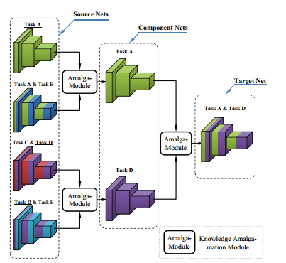

# Customizing Student Networks From Heterogeneous Teachers via Adaptive Knowledge Amalgamation
Here provided a PyTorch implementation of the paper:[Customizing Student Networks From Heterogeneous Teachers via Adaptive Knowledge Amalgamation](https://arxiv.org/pdf/1908.07121).

> **Note**: This paper mainly proposes two experiments, one for attribute experiment and the other for class experiment. This implementation is for the class experiment. The performance of this implementation is nearly as satisfying as that of experiments.  

Example codes are all in the folder `examples/knowledge_amalgamation/customize_class`.

## Pre-process data
Use `/kamal/vision/datasets/preprocess/prepare_customize/split_data.py` to process 'airplane','car','dog','cub' dataset. 

## Pre-Trained Teacher Networks

The net structure of teachers is ResNet18. More details of the source nets are provided in the [supplementary material](https://openaccess.thecvf.com/content_ICCV_2019/supplemental/Shen_Customizing_Student_Networks_ICCV_2019_supplemental.pdf).

The  pretrained weight file of ResNet18 is in the forder `examples/knowledge_amalgamation/customize_class/weights/resnet`

Use `train_sourcenet.py` to train teachers.

- `--main_class`: String. The name of main class to be componented, default `airplane` 
- `--aux_class`: String. The name of aux class for source net , default `car` 
- `--main_part`: String. The part of main class to be componented, default `1` 
- `--aux_part`: String. The id of the sorce net proposed in paper, default `1` 
- `--num_mainclass`: Int. The num of main class to be componented, default `50`
- `--num_auxclass`: Int. The num of aux class to be componented, default `49`  
- `--num_epoch`: Int. Tepoch number, default `50` 
- `--use_cuda`: Bool. default `True` 
- `--data_root`: String. The root of data, default `./data/` 
- `--save_root`: String. The root of save net , default `./snapshot/teachers/` 
- `--log_dir`: String. The root of log, default `./run/` 

If you don't set parameters in terminal, you can set in corresponding code.

## Amalgamation

  
  

Use `train.py` to combine source nets.
- `--target_class`: String. You can choose 'airplane', 'car', 'dog','cub', default 'airplane'.
- `--batch_size`: Int type, default `64`.
- `--num_epoch`: Int type. The number of epoch to be saved training source nets.
- `--component_saveEpoch`: Int type. The number of epoch to train component nets. 
- `--target_epoch`: Int type. The number of epoch to train target net. 
- `--data_root`: String. The dir of CalabA, default `./data/CelebA`
- `--save_root`: String. The dir of saved models, default `examples/knowledge_amalgamation/customize_class/`
- `--sourcenets_root`: String. The dir of source models, default `examples/knowledge_amalgamation/customize_class/snapshot/sources/`
- `--sourcedata_txtroot`: String. The dir of source net selected data txt file, default `examples/knowledge_amalgamation/customize_class/data/sources/`
- `--componentnets_root`: String. The dir of component models, default `examples/knowledge_amalgamation/customize_class/snapshot/components/`
- `--target_root`: String. The dir of target model, default `examples/knowledge_amalgamation/customize_class/snapshot/target/`
- `--log_dir`:String. The dir of log path, default `examples/knowledge_amalgamation/customize_class/run/`

